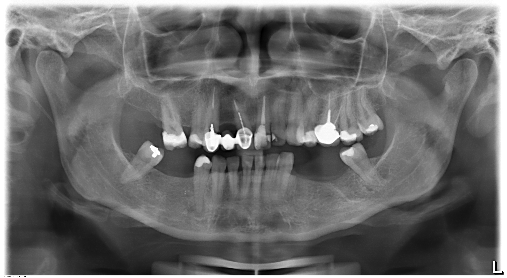
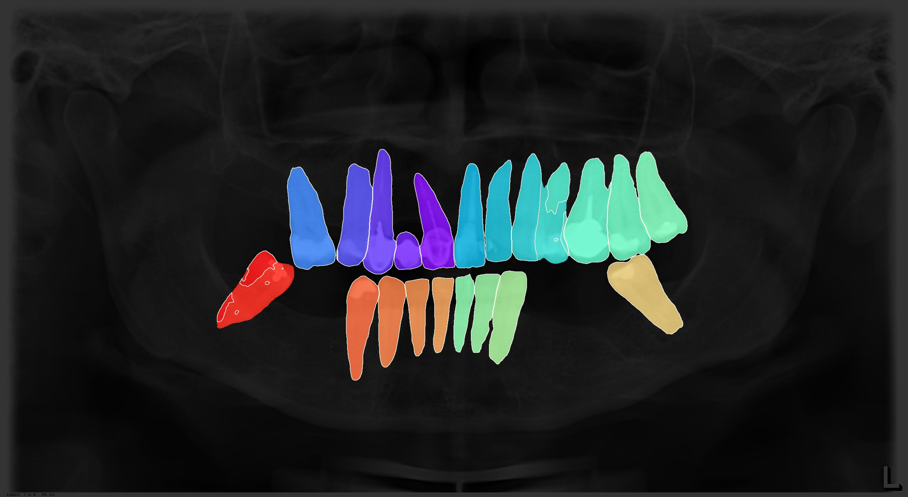
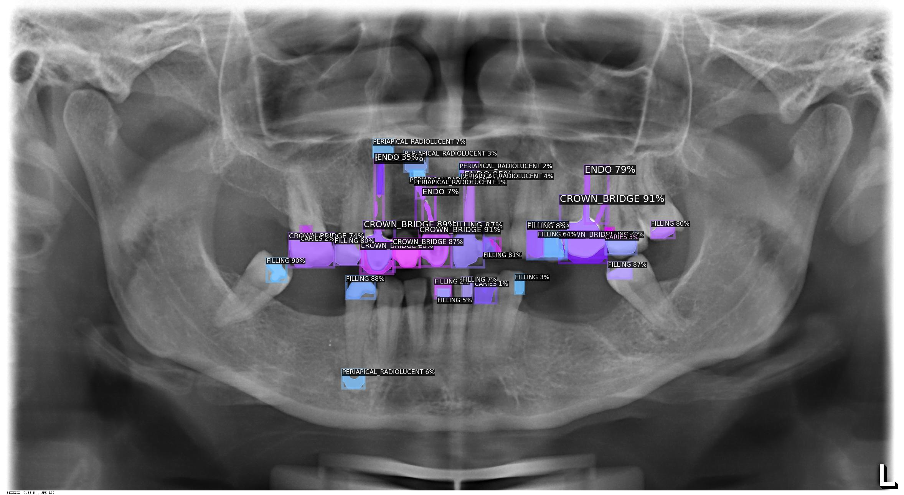

# Diagnostic AI for Dental Panoramic Radiographs

This repository provides inference code for the following research paper:

- [Artificial Intelligence to Assess Dental Findings from Panoramic Radiographs -- A Multinational Study](https://arxiv.org/abs/2502.10277), *arXiv* (2025).

The system automates the assessment of dental findings in panoramic radiographs (DPRs), detecting conditions such as missing teeth, caries, and implants.





## Quick Start Using Docker

You will need [Docker](https://docs.docker.com/get-docker/) installed on your system.
Run the following command to start the container:

```bash
docker run --rm -v $(pwd)/data:/app/data -v $(pwd)/results:/app/results stmharry/dental-pano-ai --debug
```

The DPR images in the `./data/` directory will be processed, and the results will be saved in the `./results/` directory.
See below for customizing options.

## Manual Installation

### Prerequisites

- Python 3.11
- [Poetry](https://python-poetry.org) package manager

This repository has been tested on Ubuntu 22.04 but should be functional on other platforms.

### Instructions

1. Clone the repository.
    ```bash
    git clone https://github.com/stmharry/dental-pano-ai.git && cd dental-pano-ai
    ```

2. Install dependencies using [Poetry](https://python-poetry.org).
    ```bash
    poetry install && poetry shell
    ```

3. Download [pre-trained models](https://dental-pano-ai.s3.ap-southeast-1.amazonaws.com/models.tar.gz).
    ```bash
    curl https://dental-pano-ai.s3.ap-southeast-1.amazonaws.com/models.tar.gz | tar -zx -C .
    ```
    This will extract the models to the `./models/` directory.

4. Prepare input data.
    Place your DPR images in the `./data/` directory. A sample image is provided for reference.

5. Run inference.
    By default, results are saved in `./results/`.
    ```bash
    python main.py
    ```

    To enable debugging and visualize intermediate results, use:
    ```bash
    python main.py --debug
    ```

6. Customizing inference parameters.
    The following options can be configured when running `main.py`:

    ```bash
    main.py:
      --input              Input file paths or glob patterns (default: './data/*')
      --output             Output directory (default: './results')
      --deeplab_config     Path to DeepLab config file (default: './models/deeplab/config.yaml')
      --deeplab_weights    Path to DeepLab model weights (default: './models/deeplab/model.pth')
      --yolo_config        Path to YOLO config file (default: './models/yolo/config.yaml')
      --yolo_weights       Path to YOLO model weights (default: './models/yolo/model.pt')
      --[no]debug          Enable debugging mode (default: false)
    ```

## Additional Information
This repository contains only inference (testing) code.
Training scripts are not included.
For ease of use, all libraries are installed using CPU-only versions.
For inquiries about training or further details, contact [stmharry@alum.mit.edu](mailto:stmharry@alum.mit.edu).

## Citation
If you use this work, please cite the following paper:

```bibtex
@misc{wang2025artificialintelligenceassessdental,
  title={Artificial Intelligence to Assess Dental Findings from Panoramic Radiographs -- A Multinational Study},
  author={Yin-Chih Chelsea Wang and Tsao-Lun Chen and Shankeeth Vinayahalingam and Tai-Hsien Wu and Chu Wei Chang and Hsuan Hao Chang and Hung-Jen Wei and Mu-Hsiung Chen and Ching-Chang Ko and David Anssari Moin and Bram van Ginneken and Tong Xi and Hsiao-Cheng Tsai and Min-Huey Chen and Tzu-Ming Harry Hsu and Hye Chou},
  year={2025},
  eprint={2502.10277},
  archivePrefix={arXiv},
  primaryClass={cs.CV},
  url={https://arxiv.org/abs/2502.10277},
}
```
